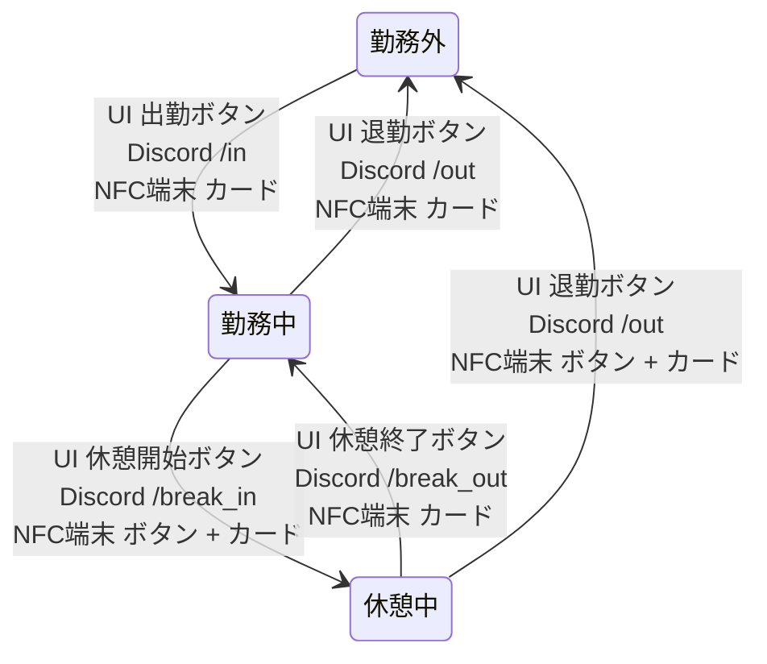
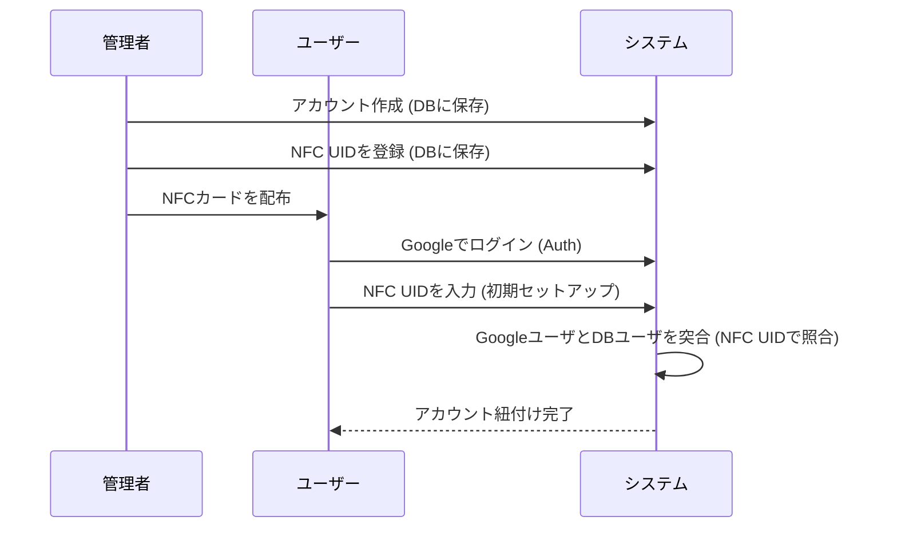

# Workly （Work + Friendly）

# Reflenge 勤怠管理+

<div style="display: flex; justify-content: center;">
  
</div>

## 1. アプリケーションの概要

* **コンセプト**: 自由な働き方を採用するベンチャー企業向けの、**シンプルで本質的な勤怠・業務管理ツール**。
* **目的**: 「いつ、誰が、どれくらい働き、何をしたか」を正確に記録し、透明性を確保することで、公正な評価とスムーズな給与計算を実現する。
* **ターゲットユーザー**:
  * **一般従業員**: 好きな時間に働く時給・月給制のメンバー。
  * **管理者**: メンバーの稼働状況と業務内容を把握し、給与計算を行う担当者。
* **システム概要**: Reflenge 勤怠管理+は、従来の勤怠管理システムを超えた「勤怠管理+」システムです。開発メンバーの技術力向上、組織のノウハウ蓄積、正確な工数見積もりを実現します。

### 実現したいこと

1. シンプルな勤怠管理
   1. 出退勤を記録する
   2. 休憩開始・休憩終了を記録する
   3. 色んな方法で記録できる
   4. その給与計算
2. プロジェクトの記録
   1. その勤怠記録のときにどのプロジェクトで何をやったかを記録することだけ実現できれば良い
   2. 誰がなんのプロジェクトにjoinして...とか複雑なものは不要

## 2. 要件定義

## 勤怠（Attendance Logs）

| アクション   | 説明                        | User:自分      | User:他人 | Admin   |
| ------- | ------------------------- | ------------ | ------- | ------- |
| report  | 集計・出力（CSV/PDF等で勤務時間をまとめる） | ✅            | ❌       | ✅       |
| read    | 閲覧（自分の全ログ、他人は状態のみ）        | ✅            | ✅ ※状態のみ | ✅       |
| create  | 新規作成（出勤・退勤・休憩打刻）          | ✅            | ❌       | ✅       |
| update  | 修正（打刻時刻や内容の変更）            | ✅ ※作成から72h以内 | ❌       | ✅ ※期限なし |
| delete  | 論理削除（誤登録を消す）              | ✅ ※作成から72h以内 | ❌       | ✅ ※期限なし |
| restore | 復元（削除した勤怠を戻す）             | ✅ ※作成から72h以内 | ❌       | ✅ ※期限なし |

---

## プロジェクト（Projects）

### プロジェクト自体

| アクション   | 説明                     | User:自分 | User:他人 | Admin |
| ------- | ---------------------- | ------- | ------- | ----- |
| report  | 集計・出力（プロジェクト単位の時間/工数）  | ✅       | ✅       | ✅     |
| read    | 閲覧（プロジェクト情報を見る）        | ✅       | ✅       | ✅     |
| create  | 新規作成（新しいプロジェクトを立てる）    | ✅       | ✅       | ✅     |
| update  | 修正（プロジェクト名や説明を変更）      | ✅       | ✅       | ✅     |
| delete  | 論理削除（不要になったプロジェクトを無効化） | ✅       | ✅       | ✅     |
| restore | 復元（削除済みプロジェクトを再有効化）    | ✅       | ✅       | ✅     |

### 記録（作業ログ）

| アクション   | 説明                  | User:自分       | User:他人 | Admin |
| ------- | ------------------- | ------------- | ------- | ----- |
| report  | 集計・出力（各人の作業内容をまとめる） | ✅             | ✅       | ✅     |
| read    | 閲覧（作業ログを読む）         | ✅             | ✅       | ✅     |
| create  | 新規作成（作業記録を追加）       | ✅          | ❌       | ✅     |
| update  | 修正（作業内容の変更）         | ❌             | ❌       | ✅     |
| delete  | 論理削除（作業ログを無効化）      | ❌             | ❌       | ✅     |
| restore | 復元（削除済み作業ログを戻す）     | ❌             | ❌       | ✅     |

---

## 給与（Payroll）

| アクション   | 説明                 | User:自分 | User:他人 | Admin |
| ------- | ------------------ | ------- | ------- | ----- |
| report  | 集計・出力（給与明細、月次レポート） | ✅（自分のみ） | ❌       | ✅     |
| read    | 閲覧（給与明細を見る）        | ✅（自分のみ） | ❌       | ✅     |
| create  | 新規作成（給与レコード登録）     | ❌       | ❌       | ✅     |
| update  | 修正（給与額や控除の編集）      | ❌       | ❌       | ✅     |
| delete  | 論理削除（誤登録を無効化）      | ❌       | ❌       | ✅     |
| restore | 復元（削除済み給与を戻す）      | ❌       | ❌       | ✅     |

---

## ユーザ（Users）

| アクション   | 説明                 | User:自分 | User:他人   | Admin |
| ------- | ------------------ | ------- | --------- | ----- |
| report  | 集計・出力（ユーザ一覧や在籍リスト） | ✅（自分関連） | ❌         | ✅     |
| read    | 閲覧（プロフィールや状態を参照）   | ✅       | ✅（公開範囲のみ） | ✅     |
| create  | 新規作成（ユーザーアカウント登録）  | ❌       | ❌         | ✅     |
| update  | 修正（自分のプロフィール編集）    | ✅       | ❌         | ✅     |
| delete  | 論理削除（アカウント停止）      | ❌       | ❌         | ✅     |
| restore | 復元（停止アカウント再有効化）    | ❌       | ❌         | ✅     |

---

## システム / カード（NFC Cards）

| アクション   | 説明               | User | Admin |
| ------- | ---------------- | ---- | ----- |
| report  | 集計・出力（カード発行状況一覧） | ❌    | ✅     |
| read    | 閲覧（カードのUIDや割当状況） | ❌    | ✅     |
| create  | 新規作成（カードを登録）     | ❌    | ✅     |
| update  | 修正（カードの再割当や状態変更） | ❌    | ✅     |
| delete  | 論理削除（カード無効化）     | ❌    | ✅     |
| restore | 復元（無効化カードを再有効化）  | ❌    | ✅     |

### 勤怠記録フロー



### User Sign Up



## DB設計

```mermaid
erDiagram
  direction TB

  %% ===== テーブル定義 =====
  User {
    uuid id PK "ユーザーID // PK: 全システムの基準キー"
    uuid auth_id "Supabase Auth ID // Supabase認証と紐付けるため"
    boolean is_admin "管理者フラグ // 管理者権限を持つかどうか"

    string last_name "名字 // 表示や検索用。給与明細などに必要"
    string first_name "名前 // 同上"
    string last_name_kana "みょうじ // フリガナ検索・帳票用"
    string first_name_kana "なまえ // 同上"
    string bio "自己紹介 // 任意。Slack連携やプロフィールに使う"
    string icon_url "アイコン画像URL // UI用"

    boolean is_active "有効フラグ // 退職・休職でfalseにしてアカウント停止"
    %% ▲ current_card_id は削除。CardAssignmentから導出する（単一情報源の原則）

    timestamptz setuped_at "セットアップ日時(UTC) // 初回Googleログイン完了タイミング"
    timestamptz created_at "作成日時(UTC) // 管理者がアカウントを作った時刻"
    timestamptz updated_at "更新日時(UTC) // 自動更新トリガ推奨"
  }

  Card {
    uuid id PK "カードID（システム内の識別子） // DB管理用のキー"
    string uid "物理NFC UID // 実カードの固有ID。不変（UNIQUE推奨）"

    boolean is_active "有効フラグ // 利用可能かどうか（在庫/回収でfalse）"
    string inactive_reason "無効理由 // 紛失・破損・回収など。空なら現役"

    timestamptz created_at "作成日時(UTC) // 発行・登録時刻"
    timestamptz updated_at "更新日時(UTC) // 更新履歴"
  }

  CardAssignment {
    uuid id PK "割当履歴ID"
    uuid user_id FK "誰に渡したか // User.id"
    uuid card_id FK "どのカードか // Card.id"
    timestamptz assigned_at "割当開始(UTC)"
    timestamptz unassigned_at "割当終了(UTC) // NULL=割当中"
    string reason "理由 // replace/return/lost等（任意）"
    uuid assigned_by_user_id "割当実施者（任意）"
    uuid unassigned_by_user_id "解除実施者（任意）"
    timestamptz created_at "作成(UTC)"
    %% NOTE: DBレベルで (card_id, unassigned_at) にUNIQUE制約を検討（unassigned_atがNULLのレコードはcard_id毎に1つ）
  }

  AttendanceLog {
    uuid id PK "勤怠区間ID // 1レコード=1つの連続状態（区間ログ）"
    uuid user_id FK "ユーザーID // 誰の勤怠か"
    smallint status_id FK "勤怠状態 // AttendanceStatus.id を参照"
    timestamptz started_at "開始時刻(UTC) // in / break_in で確定"
    timestamptz ended_at "終了時刻(UTC, NULL可) // out / break_out で確定。未確定はNULL"
    smallint started_source FK "開始の起点 // AttendanceLogSource.id を参照"
    smallint ended_source FK "終了の起点 // AttendanceLogSource.id を参照 (NULL可)"
    text note "メモ(任意) // 付随情報や一時メモなど"
    timestamptz created_at "作成時刻(UTC) // 最小監査"
    timestamptz updated_at "更新時刻(UTC) // 最小監査"
  }

  AttendanceStatus {
    smallint id PK "ステータスID // 固定シード（enum代替）。1,2,3..."
    string code "機械用コード(UNIQUE推奨) // 'OFF','WORKING','BREAK' 等。変更しない"
    string label "表示名 // '勤務外','勤務中','休憩中' 等UI表示"
    boolean is_active "有効フラグ // 将来の追加/廃止に備えて残す"
    integer sort_no "表示順 // 一覧の並びを安定させるため"
    timestamptz created_at "作成時刻(UTC) // 運用トラブル時の最小監査"
    timestamptz updated_at "更新時刻(UTC) // 同上"
  }

  AttendanceLogSource {
    smallint id PK "起点ID // 1,2,3,4"
    string code "機械用コード(UNIQUE推奨) // 'ADMIN','WEB','DISCORD','NFC' 等。変更しない"
    string label "表示名 // 'ADMIN','WEB','DISCORD','NFC' 等UI表示"
    boolean is_active "有効フラグ // 将来の追加/廃止に備えて残す"
    integer sort_no "表示順 // 一覧の並びを安定させるため"
    timestamptz created_at "作成時刻(UTC) // 最小監査"
    timestamptz updated_at "更新時刻(UTC) // 同上"
  }

  WorkLog {
    uuid id PK "作業記録ID // 主キー（1レコード=1つの作業記述）"
    uuid user_id FK "ユーザーID // 誰の作業か（作成者）"
    uuid attendance_log_id FK "勤怠区間ID // どの勤怠区間に属すか"
    uuid project_id FK "プロジェクトID // どのPJで作業したか"
    text content "作業内容 // 何をしたか（自由記述）"
    timestamptz created_at "作成時刻(UTC) // 最小監査"
    timestamptz updated_at "更新時刻(UTC) // 最小監査"
  }

  Project {
    uuid id PK "プロジェクトID // 主キー"
    string name "プロジェクト名 // UI表示・検索用"
    text description "説明 // 任意。目的やメモ"
    boolean is_active "有効フラグ // アーカイブ/休止= false"
    string inactive_reason "無効理由 // 'アーカイブ'等。空なら現役"
    timestamptz created_at "作成時刻(UTC) // 最小監査"
    timestamptz updated_at "更新時刻(UTC) // 最小監査"
  }

  UserCompensation {
    uuid id PK "給与設定ID // 人ごとのレート設定履歴"
    uuid user_id FK "ユーザーID"
    boolean is_hourly "時給フラグ // 時給で支給するか"
    boolean is_monthly "月給フラグ // 月給で支給するか（併用可想定なら両方trueも可）"
    numeric hourly_rate "時給（JPYなど、is_hourly=trueの場合のみ）"
    numeric monthly_salary "月給（JPYなど、is_monthly=trueの場合のみ）"
    string currency "通貨 // 'JPY' 等"
    timestamptz effective_from "適用開始(UTC)"
    timestamptz effective_to "適用終了(UTC, NULL可)"
    boolean is_active "現行設定フラグ（任意）"
    timestamptz created_at "作成時刻(UTC)"
    timestamptz updated_at "更新時刻(UTC)"
  }

  PayrollPeriod {
    uuid id PK "給与期間ID（締め） // 月次などの締め単位"
    date start_date "開始日（含む）"
    date end_date "終了日（含む）"
    boolean is_closed "締め済 // trueで以後編集不可"
    timestamptz closed_at "締め日時(UTC)"
    uuid closed_by_user_id "締め実行者（任意）"
    timestamptz created_at "作成時刻(UTC)"
    timestamptz updated_at "更新時刻(UTC)"
  }

  PayrollItem {
    uuid id PK "給与明細ID // 期間×ユーザー"
    uuid period_id FK "PayrollPeriod.id"
    uuid user_id FK "User.id"

    %% ▼ 月給・時給両対応できるよう拡張
    numeric base_monthly_salary "基本月給（スナップショット）"
    numeric hourly_rate "時給（スナップショット）"
    integer worked_minutes "労働分（休憩を除く集計結果）"
    numeric hourly_pay "時給計算での支給額 // (worked_minutes/60 * hourly_rate)"

    numeric total_allowance "各種手当（合計）"
    numeric total_deduction "各種控除（合計）"

    numeric gross_pay "総支給額 // (base_monthly_salary + hourly_pay + total_allowance)"
    numeric net_pay "差引支給額 // (gross_pay - total_deduction)"
    string currency "通貨 // 'JPY' 等"

    boolean is_locked "個別ロック（任意）"
    timestamptz created_at "作成時刻(UTC)"
    timestamptz updated_at "更新時刻(UTC)"

    %% NOTE: DBレベルで (period_id, user_id) にUNIQUE制約をかけること
  }

  %% ===== リレーション =====
  %% User ||--|| Card : "current_card_id" ← 削除
  User ||--o{ CardAssignment : "カード割当履歴（再利用可）"
  Card ||--o{ CardAssignment : ""

  User ||--o{ AttendanceLog : "user_id で従業員→勤怠区間"
  AttendanceStatus ||--o{ AttendanceLog : "status_id で区間の状態を指す"
  AttendanceLogSource ||--o{ AttendanceLog : "started_source で起点を指す"
  AttendanceLogSource ||--o{ AttendanceLog : "ended_source で起点を指す"

  User ||--o{ WorkLog : "user_id（誰が書いたか）"
  Project ||--o{ WorkLog : "project_id（どのPJか）"
  AttendanceLog ||--o{ WorkLog : "attendance_log_id（どの区間に紐づくか）"

  User ||--o{ UserCompensation : "時給/月給レートの履歴"
  PayrollPeriod ||--o{ PayrollItem : "期間×ユーザーの確定明細"
  User ||--o{ PayrollItem : "user_id"

```



## データベース設計書

* スキーマ：`schema.ts`（`pgTable` 等で主要制約を表現）
* 追加制約/トリガ/ビュー：SQLマイグレーション（部分ユニーク・EXCLUDE・updated\_at）

> 前提: `drizzle-orm`, `drizzle-kit`, `pg` を使用。DBはPostgreSQL（Supabase含む）。

---

# 1) `schema.ts`（Drizzleスキーマ）

```ts
// src/db/schema.ts
import {
  pgTable, uuid, boolean, text, varchar, smallint, integer, timestamp, numeric,
  primaryKey, uniqueIndex, index, foreignKey
} from "drizzle-orm/pg-core";
import { sql } from "drizzle-orm";

export const users = pgTable("user", {
  id: uuid("id").primaryKey().defaultRandom(),
  authId: uuid("auth_id").notNull(),
  isAdmin: boolean("is_admin").notNull().default(false),

  lastName: varchar("last_name", { length: 191 }).notNull(),
  firstName: varchar("first_name", { length: 191 }).notNull(),
  lastNameKana: varchar("last_name_kana", { length: 191 }),
  firstNameKana: varchar("first_name_kana", { length: 191 }),
  bio: text("bio"),
  iconUrl: text("icon_url"),

  isActive: boolean("is_active").notNull().default(true),

  setupedAt: timestamp("setuped_at", { withTimezone: true }),
  createdAt: timestamp("created_at", { withTimezone: true }).notNull().defaultNow(),
  updatedAt: timestamp("updated_at", { withTimezone: true }).notNull().defaultNow(),
}, (t) => ({
  authIdx: uniqueIndex("uniq_user_auth").on(t.authId),
}));

export const cards = pgTable("card", {
  id: uuid("id").primaryKey().defaultRandom(),
  uid: varchar("uid", { length: 191 }).notNull(), // 物理UID
  isActive: boolean("is_active").notNull().default(true),
  inactiveReason: varchar("inactive_reason", { length: 191 }),

  createdAt: timestamp("created_at", { withTimezone: true }).notNull().defaultNow(),
  updatedAt: timestamp("updated_at", { withTimezone: true }).notNull().defaultNow(),
}, (t) => ({
  uidUnique: uniqueIndex("uniq_card_uid").on(t.uid),
}));

export const cardAssignments = pgTable("card_assignment", {
  id: uuid("id").primaryKey().defaultRandom(),
  userId: uuid("user_id").notNull()
    .references(() => users.id, { onDelete: "restrict", onUpdate: "cascade" }),
  cardId: uuid("card_id").notNull()
    .references(() => cards.id, { onDelete: "restrict", onUpdate: "cascade" }),
  assignedAt: timestamp("assigned_at", { withTimezone: true }).notNull().defaultNow(),
  unassignedAt: timestamp("unassigned_at", { withTimezone: true }), // NULL=割当中
  reason: varchar("reason", { length: 191 }),
  assignedByUserId: uuid("assigned_by_user_id"),
  unassignedByUserId: uuid("unassigned_by_user_id"),
  createdAt: timestamp("created_at", { withTimezone: true }).notNull().defaultNow(),
}, (t) => ({
  // 部分ユニークは Drizzle の .where(sql``) で作れる（Postgres）
  uniqActivePerCard: uniqueIndex("uniq_active_assignment_per_card")
    .on(t.cardId)
    .where(sql`"unassigned_at" IS NULL`),
  uniqActivePerUser: uniqueIndex("uniq_active_assignment_per_user")
    .on(t.userId)
    .where(sql`"unassigned_at" IS NULL`),
  idxUser: index("idx_ca_user").on(t.userId),
  idxCard: index("idx_ca_card").on(t.cardId),
}));

export const attendanceStatus = pgTable("attendance_status", {
  id: smallint("id").primaryKey(),                   // 固定シード
  code: varchar("code", { length: 64 }).notNull(),   // 'OFF','WORKING','BREAK'
  label: varchar("label", { length: 64 }).notNull(),
  isActive: boolean("is_active").notNull().default(true),
  sortNo: integer("sort_no").notNull().default(0),
  createdAt: timestamp("created_at", { withTimezone: true }).notNull().defaultNow(),
  updatedAt: timestamp("updated_at", { withTimezone: true }).notNull().defaultNow(),
}, (t) => ({
  codeUnique: uniqueIndex("uniq_att_status_code").on(t.code),
}));

export const attendanceLogSource = pgTable("attendance_log_source", {
  id: smallint("id").primaryKey(),                   // 固定シード 1.. WEB/DISCORD/NFC/ADMIN
  label: varchar("label", { length: 64 }).notNull(),
  isActive: boolean("is_active").notNull().default(true),
  sortNo: integer("sort_no").notNull().default(0),
  createdAt: timestamp("created_at", { withTimezone: true }).notNull().defaultNow(),
  updatedAt: timestamp("updated_at", { withTimezone: true }).notNull().defaultNow(),
});

export const attendanceLogs = pgTable("attendance_log", {
  id: uuid("id").primaryKey().defaultRandom(),
  userId: uuid("user_id").notNull()
    .references(() => users.id, { onDelete: "restrict", onUpdate: "cascade" }),
  statusId: smallint("status_id").notNull()
    .references(() => attendanceStatus.id, { onDelete: "restrict", onUpdate: "cascade" }),
  startedAt: timestamp("started_at", { withTimezone: true }).notNull(),
  endedAt: timestamp("ended_at", { withTimezone: true }), // 未終了=Null
  startedSource: smallint("started_source").notNull()
    .references(() => attendanceLogSource.id, { onDelete: "restrict", onUpdate: "cascade" }),
  endedSource: smallint("ended_source")
    .references(() => attendanceLogSource.id, { onDelete: "restrict", onUpdate: "cascade" }),
  note: text("note"),
  createdAt: timestamp("created_at", { withTimezone: true }).notNull().defaultNow(),
  updatedAt: timestamp("updated_at", { withTimezone: true }).notNull().defaultNow(),
}, (t) => ({
  // “未終了1本”の部分ユニーク
  uniqActiveAttendancePerUser: uniqueIndex("uniq_active_attendance_per_user")
    .on(t.userId)
    .where(sql`"ended_at" IS NULL`),
  // 妥当性チェック（Drizzle: check constraint は raw SQL で追加が無難）
  idxUserStarted: index("idx_att_user_started").on(t.userId, t.startedAt),
}));

export const projects = pgTable("project", {
  id: uuid("id").primaryKey().defaultRandom(),
  name: varchar("name", { length: 191 }).notNull(),
  description: text("description"),
  isActive: boolean("is_active").notNull().default(true),
  inactiveReason: varchar("inactive_reason", { length: 191 }),
  createdAt: timestamp("created_at", { withTimezone: true }).notNull().defaultNow(),
  updatedAt: timestamp("updated_at", { withTimezone: true }).notNull().defaultNow(),
}, (t) => ({
  idxActiveName: index("idx_project_active_name").on(t.isActive, t.name),
}));

export const workLogs = pgTable("work_log", {
  id: uuid("id").primaryKey().defaultRandom(),
  userId: uuid("user_id").notNull()
    .references(() => users.id, { onDelete: "restrict", onUpdate: "cascade" }),
  attendanceLogId: uuid("attendance_log_id").notNull()
    .references(() => attendanceLogs.id, { onDelete: "cascade", onUpdate: "cascade" }),
  projectId: uuid("project_id").notNull()
    .references(() => projects.id, { onDelete: "restrict", onUpdate: "cascade" }),
  content: text("content").notNull(),
  createdAt: timestamp("created_at", { withTimezone: true }).notNull().defaultNow(),
  updatedAt: timestamp("updated_at", { withTimezone: true }).notNull().defaultNow(),
}, (t) => ({
  idxWorkUser: index("idx_work_user").on(t.userId, t.createdAt),
  idxWorkProject: index("idx_work_project").on(t.projectId, t.createdAt),
}));

export const userCompensation = pgTable("user_compensation", {
  id: uuid("id").primaryKey().defaultRandom(),
  userId: uuid("user_id").notNull()
    .references(() => users.id, { onDelete: "restrict", onUpdate: "cascade" }),
  isHourly: boolean("is_hourly").notNull().default(true),
  isMonthly: boolean("is_monthly").notNull().default(false),
  hourlyRate: numeric("hourly_rate"),            // is_hourly=true のとき使用
  monthlySalary: numeric("monthly_salary"),      // is_monthly=true のとき使用
  currency: varchar("currency", { length: 16 }).notNull().default("JPY"),
  effectiveFrom: timestamp("effective_from", { withTimezone: true }).notNull(),
  effectiveTo: timestamp("effective_to", { withTimezone: true }),
  isActive: boolean("is_active").notNull().default(true),
  createdAt: timestamp("created_at", { withTimezone: true }).notNull().defaultNow(),
  updatedAt: timestamp("updated_at", { withTimezone: true }).notNull().defaultNow(),
}, (t) => ({
  idxCompUserFrom: index("idx_uc_user_from").on(t.userId, t.effectiveFrom),
  // 期間重複禁止は EXCLUDE で raw SQL（下のマイグレーションで）
}));

export const payrollPeriod = pgTable("payroll_period", {
  id: uuid("id").primaryKey().defaultRandom(),
  startDate: timestamp("start_date").notNull(), // date でもOK（ここは好み）
  endDate: timestamp("end_date").notNull(),
  isClosed: boolean("is_closed").notNull().default(false),
  closedAt: timestamp("closed_at", { withTimezone: true }),
  closedByUserId: uuid("closed_by_user_id"),
  createdAt: timestamp("created_at", { withTimezone: true }).notNull().defaultNow(),
  updatedAt: timestamp("updated_at", { withTimezone: true }).notNull().defaultNow(),
}, (t) => ({
  idxPeriod: index("idx_payroll_period").on(t.startDate, t.endDate),
}));

export const payrollItem = pgTable("payroll_item", {
  id: uuid("id").primaryKey().defaultRandom(),
  periodId: uuid("period_id").notNull()
    .references(() => payrollPeriod.id, { onDelete: "cascade", onUpdate: "cascade" }),
  userId: uuid("user_id").notNull()
    .references(() => users.id, { onDelete: "restrict", onUpdate: "cascade" }),

  baseMonthlySalary: numeric("base_monthly_salary"), // スナップショット
  hourlyRate: numeric("hourly_rate"),
  workedMinutes: integer("worked_minutes").notNull().default(0),
  hourlyPay: numeric("hourly_pay").notNull().default("0"),

  totalAllowance: numeric("total_allowance").notNull().default("0"),
  totalDeduction: numeric("total_deduction").notNull().default("0"),

  grossPay: numeric("gross_pay").notNull().default("0"),
  netPay: numeric("net_pay").notNull().default("0"),
  currency: varchar("currency", { length: 16 }).notNull().default("JPY"),

  isLocked: boolean("is_locked").notNull().default(false),

  createdAt: timestamp("created_at", { withTimezone: true }).notNull().defaultNow(),
  updatedAt: timestamp("updated_at", { withTimezone: true }).notNull().defaultNow(),
}, (t) => ({
  uniqPeriodUser: uniqueIndex("uniq_payroll_item_period_user").on(t.periodId, t.userId),
  idxPayrollUser: index("idx_payroll_user").on(t.userId),
}));
```

> **ポイント**
>
> * **部分ユニーク**（未終了1本/割当1:1）は `uniqueIndex(...).where(sql\`...\`)\` でOK。
> * **外部キー**は `references()` で定義。
> * **EXCLUDE** 制約や **トリガ** は raw SQL マイグレーションで追加します。

---

# 2) 追加マイグレーション（SQL）

Drizzle は**任意SQLをマイグレーション**に書けるので、以下を分けて置くと楽です。

### a) 区間重複禁止・チェック制約

```sql
-- 2025xxxx_attendance_constraints.sql
CREATE EXTENSION IF NOT EXISTS btree_gist;

ALTER TABLE attendance_log
  ADD CONSTRAINT chk_att_time
  CHECK (ended_at IS NULL OR started_at < ended_at);

ALTER TABLE attendance_log
  ADD CONSTRAINT attendance_no_overlap
  EXCLUDE USING gist (
    user_id WITH =,
    tstzrange(started_at, COALESCE(ended_at, 'infinity')) WITH &&
  );
```

### b) 期間の妥当性・給与itemのチェック

```sql
-- 2025xxxx_payroll_constraints.sql
ALTER TABLE payroll_period
  ADD CONSTRAINT chk_period_range CHECK (start_date <= end_date);

ALTER TABLE payroll_item
  ADD CONSTRAINT chk_worked_minutes_nonneg CHECK (worked_minutes >= 0);
```

※ レート履歴（`user_compensation`）の**期間重複禁止**をDBで厳密にやるなら：

```sql
-- 2025xxxx_compensation_exclude.sql
CREATE EXTENSION IF NOT EXISTS btree_gist;
ALTER TABLE user_compensation
  ADD CONSTRAINT no_overlap_rate
  EXCLUDE USING gist (
    user_id WITH =,
    tstzrange(effective_from, COALESCE(effective_to, 'infinity')) WITH &&
  );
```

### c) `updated_at` 自動更新トリガ

```sql
-- 2025xxxx_updated_at_trigger.sql
CREATE OR REPLACE FUNCTION set_updated_at()
RETURNS trigger LANGUAGE plpgsql AS $$
BEGIN
  NEW.updated_at := now();
  RETURN NEW;
END $$;

-- 必要テーブルに付与（例）
CREATE TRIGGER trg_user_updated BEFORE UPDATE ON "user"
FOR EACH ROW EXECUTE FUNCTION set_updated_at();

CREATE TRIGGER trg_card_updated BEFORE UPDATE ON card
FOR EACH ROW EXECUTE FUNCTION set_updated_at();

CREATE TRIGGER trg_card_assignment_updated BEFORE UPDATE ON card_assignment
FOR EACH ROW EXECUTE FUNCTION set_updated_at();

CREATE TRIGGER trg_attendance_log_updated BEFORE UPDATE ON attendance_log
FOR EACH ROW EXECUTE FUNCTION set_updated_at();

CREATE TRIGGER trg_attendance_status_updated BEFORE UPDATE ON attendance_status
FOR EACH ROW EXECUTE FUNCTION set_updated_at();

CREATE TRIGGER trg_attendance_log_source_updated BEFORE UPDATE ON attendance_log_source
FOR EACH ROW EXECUTE FUNCTION set_updated_at();

CREATE TRIGGER trg_work_log_updated BEFORE UPDATE ON work_log
FOR EACH ROW EXECUTE FUNCTION set_updated_at();

CREATE TRIGGER trg_project_updated BEFORE UPDATE ON project
FOR EACH ROW EXECUTE FUNCTION set_updated_at();

CREATE TRIGGER trg_user_compensation_updated BEFORE UPDATE ON user_compensation
FOR EACH ROW EXECUTE FUNCTION set_updated_at();

CREATE TRIGGER trg_payroll_period_updated BEFORE UPDATE ON payroll_period
FOR EACH ROW EXECUTE FUNCTION set_updated_at();

CREATE TRIGGER trg_payroll_item_updated BEFORE UPDATE ON payroll_item
FOR EACH ROW EXECUTE FUNCTION set_updated_at();
```

### d) “現役カード”の導出ビュー（current\_card\_id の代替）

```sql
-- 2025xxxx_views.sql
CREATE OR REPLACE VIEW v_current_card_assignment AS
SELECT user_id, card_id
FROM card_assignment
WHERE unassigned_at IS NULL;
```

---

# 3) シード（固定テーブル）

`attendance_status` と `attendance_log_source` は **enum代替の固定行**。
Drizzle の「seedスクリプト」や SQL マイグレーションで入れてください。

```sql
-- 2025xxxx_seed_status_and_source.sql
INSERT INTO attendance_status (id, code, label, is_active, sort_no)
VALUES
  (1,'OFF','勤務外',true,1),
  (2,'WORKING','勤務中',true,2),
  (3,'BREAK','休憩中',true,3)
ON CONFLICT (id) DO NOTHING;

INSERT INTO attendance_log_source (id, label, is_active, sort_no)
VALUES
  (1,'WEB',true,1),
  (2,'DISCORD',true,2),
  (3,'NFC',true,3),
  (4,'ADMIN',true,4)
ON CONFLICT (id) DO NOTHING;
```

---

## 使い方メモ

* **“出勤”**: `attendance_log` に `ended_at = NULL` の行が無いことを確認 → `WORKING` で `started_at=now()` をINSERT

* **“退勤”**: 直近 `ended_at IS NULL` の行を `ended_at=now()` でUPDATE

* **休憩**: `WORKING`を閉じて `BREAK` を開く → 終了で `WORKING` を新規開始（順序で“未終了2本”を避ける）

* **カード差し替え**: トランザクションで

  1. 旧 `card_assignment.unassigned_at=now()`
  2. 新 `card_assignment` をINSERT（同時割当は禁止制約が守ってくれる）

* **給与締め**: 期間作成 → 勤怠集計して `payroll_item` 更新 → period を `is_closed=true`（以後はRLSやアプリで編集禁止）


---

This is a [Next.js](https://nextjs.org) project bootstrapped with [`create-next-app`](https://nextjs.org/docs/app/api-reference/cli/create-next-app).

## Getting Started

First, run the development server:

```bash
npm run dev
# or
yarn dev
# or
pnpm dev
# or
bun dev
```

Open [http://localhost:3000](http://localhost:3000) with your browser to see the result.

You can start editing the page by modifying `app/page.tsx`. The page auto-updates as you edit the file.

This project uses [`next/font`](https://nextjs.org/docs/app/building-your-application/optimizing/fonts) to automatically optimize and load [Geist](https://vercel.com/font), a new font family for Vercel.

## Learn More

To learn more about Next.js, take a look at the following resources:

- [Next.js Documentation](https://nextjs.org/docs) - learn about Next.js features and API.
- [Learn Next.js](https://nextjs.org/learn) - an interactive Next.js tutorial.

You can check out [the Next.js GitHub repository](https://github.com/vercel/next.js) - your feedback and contributions are welcome!

## Deploy on Vercel

The easiest way to deploy your Next.js app is to use the [Vercel Platform](https://vercel.com/new?utm_medium=default-template&filter=next.js&utm_source=create-next-app&utm_campaign=create-next-app-readme) from the creators of Next.js.

Check out our [Next.js deployment documentation](https://nextjs.org/docs/app/building-your-application/deploying) for more details.
